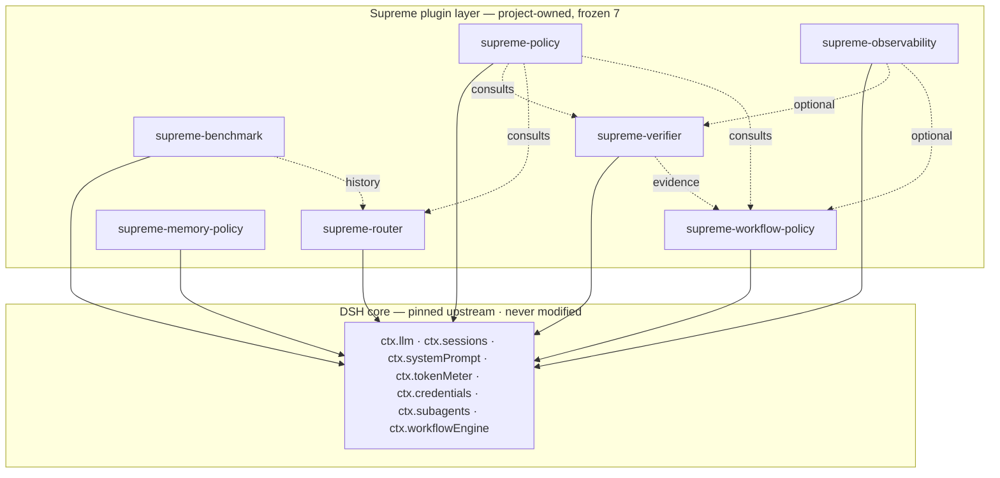

<p align="center">
  <picture>
    <source media="(prefers-color-scheme: dark)" srcset="./assets/hero-dark.svg">
    
  </picture>
</p>

<div align="center">

# 🛡️ DSH SUPREME

### The governance layer for [DeepSeek Harness](https://github.com/deepseek-ai/deepseek-harness)

*"ECC gives your harness breadth. Supreme gives it a conscience."*

[](https://github.com/stadeummwt/dsh-supreme/actions/workflows/ci.yml)


**Install** · `dsh plugin --profile <your-profile> add github:stadeummwt/dsh-supreme`

[At a glance](#-at-a-glance) · [Why Supreme](#-why-supreme) · [Install](#-60-second-install) · [The seven plugins](#-the-seven-governance-plugins) · [Proof wall](#-proof-wall--every-verdict-runnable) · [Security](#-security-guarantees) · [v1.3.1 fixes](#-v131-review-hardening) · [Benchmarks](#-benchmarks-v131) · [Docs](#-documentation-map) · [FAQ](#-faq)

</div>

---

## 📊 At a glance

Every row below is re-runnable — see the [proof wall](#-proof-wall--every-verdict-runnable).

| Metric | Value |
|---|---|
| Full suite | **101/101** Level-A checks · **5/5** real-loader boots · `VERDICT COMPLETE` |
| v1.3.1 review probes | **465/465** across 7 verifiers |
| v1.3 E2E probes | **184/184** (policy 85 · workflow 82 · routing 17) |
| Verdict markers | **14 green** (`suite` · `v131:verify` · `v13:verify` · `bundle:verify` · `composition:verify` · `v12:verify` · `v3:verify`) |
| Policy benchmark A/B/C | **0 escapes** after patch · benign **75/75** · Astra `NOT_RUN` (honest label) |
| Router latency | ≈ **0.02–0.04 ms / 1k** decisions · RM0-first |
| Secret sentinel leaks | **0** every run |
| Upstream patches | **0** — pinned `d347e703908d`, worktree clean |
| License | MIT |

---

## 🤔 Why Supreme

DSH's plugin ecosystem (3,421 catalog entries reviewed, 2026-09) is rich in
**single-domain tools** — a router here, a memory store there, a verifier
somewhere else. Each solves one slice of governance and asks you to trust its
output.

**Supreme is the opposite design.** It is a full governance *stack* — cost
policy, observability, routing, verification, memory policy, workflow limits,
security audit — that treats **proof as a product feature**: every claim in
this README maps to a command you can run, and every hard rule (deny paths,
cost gates, secret scrubbing) is deterministic code, not model judgment.

| The usual DSH plugin | DSH Supreme |
|---|---|
| Solves **one** domain | **Seven** governance domains, one install |
| "Trust the output" | **Verdict gates** — `COMPLETE` only when every check passes |
| Config verified by vibes | **Config-key hygiene scan** against real zod schemas (silent-strip trap closed) |
| Markdown evidence | **Published JSON Schemas** + append-only JSONL evidence stores |
| Touches core or monkey-patches | **Zero upstream patches** — pinned upstream, worktree clean, verified every run |
| Security as a README paragraph | **Six-surface security audit** (prompts · hooks · MCP · permissions · secrets · agent files) in CI |
| No ML dependency | Also **no ML** — deterministic counting, globs and comparisons only. Speed is a feature: router decision ≈ **0.02–0.03 ms / 1k iterations** |

> **The core rule of this repo:** *bukti sebenar > klaim* — real evidence over
> claims. If a statement here can't be re-run by you, it's marked as a claim,
> not a fact.

---

## ⚡ 60-second install

The repository **is** a [`dsh` bundle](#-install-as-a-dsh-bundle) — no build
step needed (`dist/` is committed):

```bash
dsh plugin --profile <your-profile> add github:stadeummwt/dsh-supreme
```

That mounts all **seven** plugins with safe production defaults:

```text
PAID / TRIAL routes  → DENIED (hard rule, LAB-only override)
UNKNOWN cost class   → DENIED
commands / network   → OFF by default
router candidates    → you add yours in your own patch layer (last write wins)
```

### Zero-thought path: one command does everything

Don't want to think about environments, builds, or profiles at all? The
built-in operator CLI (zero dependencies) diagnoses, installs, composes and
**boot-proves** your setup:

```bash
node real/supreme.mjs doctor    # what's missing? (prints a fix line per check)
node real/supreme.mjs setup     # EVERYTHING: builds what's missing, runs the real
                                # `dsh plugin add`, applies the composition,
                                # boot-probes it → "SUPREME READY"
node real/supreme.mjs verify    # full verification ladder, PASS/FAIL per gate
node real/supreme.mjs setup --composition standard   # core|standard|supreme|lab
```

`setup` is idempotent and never modifies the upstream checkout. It will
clone + pin + build the pinned DSH upstream only if it is missing (skip with
`--no-upstream-build`).

> **v1.3.2 note (Windows):** if an earlier version showed
> `bundle:verify … obs stats 0` or a `composition:verify` dataDir failure —
> root cause found and fixed (store engines created their parent directory
> with a POSIX-only separator check; on Windows every record write was
> silently dropped). Re-run `setup` (rebuilds `dist/`), then re-run the
> verifiers — they now also print full writer stats + an exact diagnosis
> instead of a bare zero.

Pick a **composition** in one more line if you don't need all seven:

| Fragment | Active plugins | Use it for |
|---|---|---|
| [`core`](./config/compositions/core.patch.yml) | policy | governance floor on any profile |
| [`standard`](./config/compositions/standard.patch.yml) | policy · observability · memory · verifier | daily-driver |
| [`supreme`](./config/compositions/supreme.patch.yml) | all seven | full stack |
| [`lab`](./config/compositions/lab.patch.yml) | all seven + LAB overrides | experiments only — never production |

```bash
dsh --profile <your-profile> \
  --patch "$DSH_HOME/profiles/<your-profile>/node_modules/dsh-supreme/config/compositions/standard.patch.yml"
```

---

## 🧩 The seven governance plugins

Exactly seven. The scope is **frozen** ([AGENTS.md](./AGENTS.md)) — no scope
creep without a proven blocker.

| # | Plugin | Service | What it enforces |
|---|---|---|---|
| 1 | [`supreme-policy`](./src/plugins/supreme-policy/) | `supremePolicy` | Cost-class / risk / delegation admission. `UNKNOWN` cost ⇒ **DENY**. Paid & trial overrides are LAB-only. Unicode-taint + encoding-blob detection & denial. CoT presence gate with visibility profiles + risk gating. Deny-circumvention (`deny_retry`) guard. Capability-class gate. |
| 2 | [`supreme-observability`](./src/plugins/supreme-observability/) | `supremeObservability` | Append-only JSONL metadata log over official DSH event seams. Allowlisted fields, **secret-sentinel scrub**, fail-open. |
| 3 | [`supreme-benchmark`](./src/plugins/supreme-benchmark/) | `supremeBenchmark` | Reproducible task/run/score JSONL evidence; per-model aggregation that feeds the router; `commitHash` + `irVersion` provenance binding; `evidenceBacked` anti-sandbagging flag. |
| 4 | [`supreme-router`](./src/plugins/supreme-router/) | `supremeRouter` | Deterministic selection: **8 hard gates** → weighted scoring → **RM0-first** cost-class rule → `unscoredEvidenceWeight` anti-sandbagging downweight → optional verifier-failure-driven effort pacing. Carries `CapabilitySignal` labels onto decisions. |
| 5 | [`supreme-verifier`](./src/plugins/supreme-verifier/) | `supremeVerifier` | Deterministic validator registry (exact-text · regex · JSON · file · command). **Evidence > model self-confidence.** |
| 6 | [`supreme-memory-policy`](./src/plugins/supreme-memory-policy/) | `supremeMemoryPolicy` | Memory *selection policy*: confidence floor, injection cap, relevance ranking, bounded append-only note ledger (credential-bearing notes rejected at admission). |
| 7 | [`supreme-workflow-policy`](./src/plugins/supreme-workflow-policy/) | `supremeWorkflowPolicy` | When/how `ctx.subagents` / `ctx.workflowEngine` may run: limits, degradation ladder, glob **path scoping** (blocked beats allowed), verifier-gated close for HIGH-risk tasks, **A2A contact graph** + **overreach audit**. |



Four support plugins (`supreme-minimal-probe`, `supreme-boot-probe`,
`supreme-gate-driver`, `supreme-fake-llm`) exist **only** as test fixtures for
the suite — they never ship in the bundle.

---

## 🏁 Proof wall — every verdict runnable

Don't trust this README. Run these:

| Command | Verdict marker | What it proves |
|---|---|---|
| `bun run suite` | `COMPLETE` | **101/101** Level-A checks + **5/5** real-loader boots + v1.2/v1.3/v1.3.1 audit gates |
| `bun run v131:verify` | `V131_COST_FIX_VERIFIED` · `V131_VERIFIER_FIX_VERIFIED` · `V131_MEMORY_FIX_VERIFIED` · `V131_A2A_FIX_VERIFIED` · `V131_EVIDENCE_BINDING_VERIFIED` · `V131_OUTCOME_ROUTING_VERIFIED` · `V131_FAILURE_INJECTION_VERIFIED` | Review-hardening end-to-end: cost pre-dispatch deny, symlink-proof roots, JSON-schema strictness, memory isolation, A2A registry, evidence staleness, outcome routing, failure injection (**465 probes** — see [`docs/REVIEW-FIXES-v1.3.1.md`](./docs/REVIEW-FIXES-v1.3.1.md)) |
| `bun run v13:verify` | `V13_POLICY_E2E_COMPLETE` · `V13_WORKFLOW_E2E_COMPLETE` · `V13_ROUTING_E2E_COMPLETE` | All 7 v1.3 ASTRA features end-to-end: real engines + real pinned-cordis adapters (85 + 82 + 17 probes) |
| `bun run bundle:verify` | `BUNDLE_E2E_COMPLETE` | Real `dsh plugin add` → reconciler → boot → 13 services → user-patch override wins → clean dispose |
| `bun run composition:verify` | `COMPOSITIONS_E2E_COMPLETE` | All 4 fragments: service presence **and absence**, relative `dataDir` write-through |
| `bun run v12:verify` | `V12_E2E_COMPLETE` | Every v1.2 config key **arrives at its service** + functional probes (taint deny, effort escalation/recover, path scope, close gate, ledger) |
| `bun run v3:verify` | `V3_CONFIG_REVIEW_EVIDENCE` | The silent-strip trap, live: a wrong config loses 5/6 keys → corrected config enforces 6/6 |

```text
Level A unit checks      101/101 PASS  (policy 17 · observability 7 · benchmark 11 · router 23
                                       verifier 11 · memory 13 · workflow 19)
v1.3.1 review probes     465/465      (cost 37 · verifier 43 · memory 88 · a2a 63 ·
                                       evidence 82 · outcome-routing 80 · failure-injection 72)
v1.3 E2E probes          184/184      (policy 85 · workflow 82 · routing 17 — real engines,
                                       real pinned-cordis adapters, no upstream build needed)
Real-loader boots        5/5 PASS     (supreme-minimal, core, standard, supreme, lab)
  boot times             supreme-minimal ~51–60 ms · core/standard/supreme/lab ~830–990 ms
Keyless scenario         9/9 gates PASS (real DSH session; router picks free route; PAID rejected)
Security                 sentinel leaks = 0 · paid automatic fallback = DISABLED
v1.2/v1.3 audit gates    config-key hygiene PASS · pinned-ref scan PASS ·
                         six-surface audit PASS (incl. the pinned `workflow/agent-start` seam) ·
                         schema contract PASS (3 schemas)
Upstream integrity       commit unchanged · worktree clean · patches = 0
Performance              router ≈ 0.02–0.04 ms / 1k · observability serialize ≈ 0.001–0.007 ms / 1k
VERDICT                  COMPLETE
```

**Honesty rule:** the real-loader path (`real/boot.mjs`) is the **only**
real-integration evidence. The Level-A harness under `src/harness/cordis-mini`
is a lifecycle fixture — it is **never** cited as DSH proof.

---

## 🔐 Security guarantees

| Guarantee | Mechanism | Proof |
|---|---|---|
| Secrets never leak through observability | Secret-sentinel scrub on allowlisted fields, fail-open write path | suite: `sentinelLeaks = 0` every run |
| Tainted tool arguments can't dispatch | Unicode class scan (zero-width / bidi / BOM / tag) + `taintPolicy: DENY` via upstream `tools/pre-execute` | `V12_E2E_COMPLETE` functional probe |
| Denying a command actually stops it | Deny-circumvention guard: same-shape retry of a denied call refused (`deny_retry`) — signature carries names/types, never values | `V13_POLICY_E2E_COMPLETE` probes |
| Hidden payloads can't ride in tool args | Encoding-blob scan (≥256-char base64/hex runs), class names + lengths only | `V13_POLICY_E2E_COMPLETE` probes |
| Self-declared capability labels can't buy permission | `capabilityClassGate` ENFORCE/AUDIT; LAB allowlist is floor-bound; labeling only RESTRICTS | `V13_POLICY_E2E_COMPLETE` probes |
| Inter-agent channels stay on the declared graph | `allowedContacts` directed edges; out-of-graph audited (`a2a_contact`), DENY blocks pre-fact | `V13_WORKFLOW_E2E_COMPLETE` probes |
| Delegations can't quietly exceed their task | Overreach audit: risk ceiling + approval gate + path scope, value-free | `V13_WORKFLOW_E2E_COMPLETE` probes |
| Benchmark scores can't sandbag the router | `evidenceBacked` flag (verifier-PASS rule) + fixed `unscoredEvidenceWeight` downweight | `V13_ROUTING_E2E_COMPLETE` probes |
| Values never echoed in audit events | Taint/contact/overreach events carry **class names, ids and levels only** | code + suite checks |
| Paid models never fire by accident | `UNKNOWN` cost ⇒ DENY; `allowPaid` refused outside LAB; no automatic fallback | keyless scenario gate 9/9 |
| Destructive delegation is scoped | `blockedPaths` > `allowedPaths` glob enforcement; `DENY_ALL` secret policy | suite checks 15 (workflow) |
| HIGH-risk work can't skip verification | `requireVerifierPassOnClose` evidence gate | `V12_E2E_COMPLETE` probe |
| Supply chain stays pinned | External refs scanned; upstream commit + `irVersion` bound into run records | pinned-ref scan PASS |
| Your own audit, offline | **Six-surface audit**: prompts · hooks · MCP · permissions · secrets · agent files | suite check PASS |

---

## 🛡️ v1.3.1 review-hardening

Response to an external v1.3.0 review: **5 findings reproduced → fixed → proven**
(each with a failing test on the original code), plus outcome-based routing,
evidence-bound verification, fast path/recovery, and a failure-injection
harness. Full per-issue evidence — reproduction commands, root causes, before/
after outputs, remaining limits, and rollback steps (bash + PowerShell) — lives
in [`docs/REVIEW-FIXES-v1.3.1.md`](./docs/REVIEW-FIXES-v1.3.1.md).

| # | Severity | Finding (v1.3.0) | Fix (v1.3.1) |
|---|---|---|---|
| A | P1 | Paid/unknown-model LLM requests dispatched with no cost check | Pre-dispatch deny at `agent/request` + `llm/stream` backstop; zero adapter calls on deny; UNKNOWN denied in production RM0; LAB exception contract kept |
| B | P1 | Symlink inside `allowedRoots` escaped the file-hash verifier | Native realpath validation of roots AND targets before any read; traversal/sibling-prefix/missing-file rejected; race reduced (not race-proof — documented) |
| C | P1 | `latestSelection` shared across sessions/tasks (memory contamination) | Selections bound to (session, task); unknown identity → empty; bounded LRU + cleanup on end/cancel/dispose |
| D | P2 | `copy_file {target: b.txt}` misclassified as agent-to-agent contact | Trusted comms-tool registry gates recipient extraction; post-fact emit stays detect-only |
| E | P2 | JSON Schema `additionalProperties:false` silently ignored (false PASS) | Deterministic validator: unsupported keywords → `ERROR`/`UNAVAILABLE`, never silent downgrade |

Run it: `bun run v131:verify` (7 markers, 465 probes) — then read the doc before trusting this table.

## 📈 Benchmarks v1.3.1

Policy-enforcement delta across three labels — same runner, same datasets,
thresholds frozen **before** evaluation, dev + held-out inputs disjoint:

| Label | Setup | Result |
|---|---|---|
| **A** | harness **without** Supreme | **30** cost-policy bypasses |
| **B** | Supreme **v1.3.0** (pre-review-fix) | **90** escapes (cost 30 · memory 15 · symlink 15 · A2A false-deny 15 · schema false-pass 15) |
| **C** | Supreme **v1.3.1** | **0 escapes — all kinds** · benign pass **75/75** · overhead ≈ 10 ms/set (median 93 vs 82 ms) |

All 6 thresholds PASS. Safety regressions (benign denials) block promotion.

- Method, limits and cleanup record: [`benchmarks/BENCH-v1.3.1.md`](./benchmarks/BENCH-v1.3.1.md)
- Thresholds-then-evaluate: [`benchmarks/THRESHOLDS-v1.3.1.json`](./benchmarks/THRESHOLDS-v1.3.1.json) · raw runs: [`benchmarks/runs/`](./benchmarks/runs/)
- Re-run yourself: `bun real/bench-v131.mjs --label C --reps 1` → `BENCH_C_THRESHOLDS_PASS`
- **Astra (GPT-6): `NOT_RUN`** — no verified public evaluation data; never
  fabricated ([research note](./research/gpt6-astra-2026-09.md)). This is a
  policy-enforcement benchmark, **not** a model-quality ranking.

## 🧬 v1.3 ASTRA-hardening features

Seven deterministic hardening features from the ASTRA-1 backlog
([`research/gpt6-astra-2026-09.md`](./research/gpt6-astra-2026-09.md) §7).
No ML, no new deps — every feature is engine-checked in the keyless suite and
proven end-to-end by `bun run v13:verify` (real engines + real pinned-cordis
adapters). The shared label contract `CapabilitySignal
{ capabilityClass?, cotVisibility? }` is exported by `supreme-policy` and
carried (never enforced) by the router.

<details>
<summary><b>supreme-policy — four features (config table)</b></summary>

| Config key | Default | Meaning |
|---|---|---|
| `cotVisibilityProfiles` | `{}` | routeId → expected CoT visibility. A route declared `none` **never denies** on `cot_missing` — ENFORCE downgrades to audit-only (empty-CoT models can't be coerced into producing a trace). Resolution: explicit signal > profile > `verbose`. |
| `riskGatedCoT` | `false` | ENFORCE applies only to HIGH-risk tools (deterministic command/network/write name classifier); non-HIGH tools keep AUDIT. |
| `denyCircumventionGuard` | `true` | A same-shape retry of an already-denied call is refused with reason code `deny_retry`. The signature encodes argument NAMES + TYPES only — values can never enter it. First calls unaffected; `resetDenyCircumvention(sessionId)` is the escape hatch. |
| `enableEncodingScan` | `false` | Audit/deny ≥256-char base64/hex runs in tool arguments (`encoding_blob`; argument NAME + run LENGTH only). Extends the v1.2 taint surface: same event, same `taintPolicy`. |
| `capabilityClassGate` | `'OFF'` | Gate requests carrying `capabilityClass`: `AUDIT` records, `ENFORCE` denies unsanctioned classes. Unlabeled requests always pass untouched. |
| `sanctionedCapabilityClasses` / `labCapabilityClassAllowlist` | `[]` / `[]` | Sanction lists; the LAB allowlist is additive and binds ONLY on the LAB floor. No implicit `ROUTINE` exemption — a self-declared label can only RESTRICT, never grant. |

</details>

<details>
<summary><b>supreme-workflow-policy — two features (config table)</b></summary>

| Config key | Default | Meaning |
|---|---|---|
| `agentContactPolicy` / `allowedContacts` | `'LOG_ONLY'` / `[]` | A2A contact graph: directed `{ from, to }` edges of agent ids/roles (empty = inert). Out-of-graph spawn/message contacts are audited as `a2a_contact`; under `'DENY'` the pre-fact `tools/pre-execute` waterfall refuses with `a2a_contact_denied`. Emit-mode seams are DETECT-only. |
| `maxRiskLevel` / `approvalRequiredFor` | `'HIGH'` / `[]` | Overreach audit: delegations above the risk ceiling, listed task classes without an approval flag, or paths outside the v1.2 scope are audited as `overreach_suspected` (labels, levels, flags, config globs — never content). |

</details>

<details>
<summary><b>supreme-router + supreme-benchmark — anti-sandbagging (config table)</b></summary>

| Config key | Plugin | Default | Meaning |
|---|---|---|---|
| `requireEvidenceForScores` | benchmark | `false` | Score claims without verifier-PASS evidence are flagged `evidenceBacked: false` on the score + run (flag only — scores never rewritten; re-evaluated when verification lands late). |
| `unscoredEvidenceWeight` | router | `1` | FIXED multiplicative downweight for unevidenced benchmark claims (e.g. `0.5` halves such scores); ids + factors recorded on the decision + `unscored_evidence` events (ids only). `1` = off, back-compat. |
| — | router | — | Carries `capabilityClass` / `cotVisibility` labels from candidates onto the selected `RouteDecision` (carrier, not enforcer). |

</details>

<details>
<summary><b>Composition fragments (v1.3 posture)</b></summary>

| Fragment | v1.3 keys |
|---|---|
| `core` | `denyCircumventionGuard: true` pinned (the one default-ON); everything else inherits OFF defaults |
| `standard` | `enableEncodingScan: true` + `capabilityClassGate: AUDIT` — audit-only, cannot block |
| `supreme` | same audit-only policy posture + `requireEvidenceForScores: true` + workflow keys pinned at behavior-preserving defaults |
| `lab` | enforcing demo: `capabilityClassGate: ENFORCE` + `labCapabilityClassAllowlist`, `cotVisibilityProfiles` + `riskGatedCoT`, declared contact graph + `maxRiskLevel: MEDIUM`, `unscoredEvidenceWeight: 0.5` |

</details>

---

## 🧬 v1.2 governance features

Deterministic. No ML. No new runtime deps. Every feature binds to a **real
pinned upstream seam** and ships with engine checks + boot-level proof
(`bun run v12:verify`).

<details>
<summary><b>supreme-policy — unicode taint denial + CoT presence gate</b></summary>

Upstream freezes tool arguments after logging (wrappers may change only
`exec.signal`), so the enforceable host-side posture is **detect → audit →
deny** through the official `tools/pre-execute` seam (`{ kind: 'deny',
reason }` — upstream materializes the error result; Supreme never fabricates
tool output):

| Config key | Default | Meaning |
|---|---|---|
| `enableUnicodeSanitization` | `true` | scan tool arguments for zero-width / bidi-isolate / bidi-override / tag codepoints (U+200B–200F, U+2060–206F, U+202A–202E, U+FEFF, U+E0000–E007F) |
| `logTaintAttempts` | `true` | record `taint_detected` events — class names only, values are NEVER echoed |
| `taintPolicy` | `LOG_ONLY` | `DENY` refuses the call before dispatch |
| `reasoningTracePolicy` | `OFF` | `AUDIT` records `cot_missing` when an assistant message carried no reasoning trace; `ENFORCE` additionally denies that session's tool calls (`ENFORCE` refused on the CORE floor) |

</details>

<details>
<summary><b>supreme-router — RM0-first + effort pacing</b></summary>

| Config key | Default | Meaning |
|---|---|---|
| `costFirst` | `true` | score only the cheapest eligible cost class — `FREE_CONFIRMED` beats a rate-limited peer with better history; hard-gate evidence for ALL candidates preserved |
| `effortPacing.enabled` | `false` | deterministic `costClass → reasoningEffort` mapping over the pinned `agent/request` seam (pinned DeepSeek levels: `off / low / high / max`) |
| `effortPacing.escalateOnVerifierFail` | `true` | one-step escalation (`low → high`) driven **only** by verifier FAIL evidence via `reportVerifierOutcome()` — never model self-confidence; PASS recovers |

</details>

<details>
<summary><b>supreme-workflow-policy — surgical path scope + verifier-gated close</b></summary>

| Config key | Default | Meaning |
|---|---|---|
| `allowedPaths` / `blockedPaths` | `[]` / `[]` | zero-dependency glob scope for delegations (`**` crosses segments, `*`/`?` stay in-segment); **blocked always wins**; empty allowlist = unrestricted |
| `requireVerifierPassOnClose` | `false` | HIGH-risk tasks may only close with recorded verifier PASS evidence |

</details>

<details>
<summary><b>supreme-memory-policy — bounded ledger + instinct-style gates</b></summary>

| Config key | Default | Meaning |
|---|---|---|
| `ledgerEnabled` | `false` | opt-in bounded, append-only JSONL note ledger (`ledgerDir`, `ledgerFileName`, `ledgerMaxEntries`) — credential-bearing notes rejected at admission |
| `minConfidence` | `0.7` | notes below this confidence never inject (ECC instincts analogue — recorded evidence quality, not self-assessment) |
| `maxInjected` | `6` | hard cap per selection |
| `relevanceRanking` | `true` | deterministic task-token-overlap ranking before priority (counting, not ANN) |

</details>

<details>
<summary><b>supreme-benchmark — provenance binding + published schemas</b></summary>

Run records accept `commitHash` (40-hex sha or `UNAVAILABLE`) and `irVersion`
— malformed values are rejected by validation, so routing evidence stays bound
to the code that produced it.

- [`schemas/suite-report.schema.json`](./schemas/suite-report.schema.json) ·
  [`benchmark-record.schema.json`](./schemas/benchmark-record.schema.json) ·
  [`ledger-note.schema.json`](./schemas/ledger-note.schema.json) — third
  parties can validate reports/records; a suite check keeps schemas and code
  from drifting.
- Suite also runs **config-key hygiene** (every shipped YAML row validated
  against the plugin's real zod schema — the silent-strip trap stays closed),
  **pinned-ref** scan, and the **six-surface security audit**.

</details>

---

## 📦 Install as a dsh bundle

The repository IS the bundle: `package.json` declares `dsh.bundle.patch` →
[`cordis.patch.yml`](./cordis.patch.yml), which inserts the seven frozen
plugins as profile rows. Any profile can adopt Supreme through the official
plugin flow:

```bash
# from a local checkout…
dsh plugin --profile <your-profile> add /path/to/dsh-supreme
# …or straight from GitHub
dsh plugin --profile <your-profile> add github:stadeummwt/dsh-supreme

# prove an install end-to-end (real CLI install + boot + layering checks)
bun run bundle:verify
# prove the v1.2 config surface end-to-end
bun run v12:verify
# prove the v1.3 ASTRA-hardening features end-to-end (all three verifiers)
bun run v13:verify
```

The bundle mounts the seven plugins with **safe production defaults** (PAID /
TRIAL denied, commands/network off, zero router candidates). Extend
candidates, project knowledge, and workflow limits from YOUR profile patch
layer — the composer applies `last write wins` per row id, so user config
always beats bundle defaults. The four support/fixture plugins are NOT part of
the bundle: they never ship into user profiles.

**Composition fragments** ship under
[`config/compositions/`](./config/compositions/) — the bundle-world analogue
of manifest-driven install profiles. Each fragment UPDATE-patches the bundle
rows by id (whole-`config` replacement, `disabled: true` for rows outside the
composition) and carries no `name` restatement, so it stays
install-location-independent. Prove all four end-to-end:
`bun run composition:verify` → `COMPOSITIONS_E2E_COMPLETE`.

Notes: `dsh plugin add` requires `pnpm` on PATH; installing from GitHub works
without a `prepare` build because `dist/` is committed. Fragment paths are
relative to the dsh process working directory — override any row from your
own patch layer.

---

## 🏗️ Architecture

```text
┌────────────────────────────────────────────────────────────────────┐
│  Next.js dashboard (project app) — PROJECTION only, owns no state  │
│  GET/POST /api/supreme/*  (dev/LAB only)                           │
└──────────────────────────────┬─────────────────────────────────────┘
                               │ reads suite reports / triggers runs
┌──────────────────────────────▼─────────────────────────────────────┐
│  SUPREME PLUGIN LAYER (dsh-supreme/dist/plugins, project-owned)    │
│  policy · observability · benchmark · router · verifier ·          │
│  memory-policy · workflow-policy  (+ 4 support/fixture plugins)    │
│  Cordis conventions: name/inject/Config(Standard Schema)/apply     │
└──────────────────────────────┬─────────────────────────────────────┘
                               │ inject: official DSH service names
┌──────────────────────────────▼─────────────────────────────────────┐
│  DSH CORE (pinned upstream — never modified)                       │
│  ctx.llm · ctx.sessions · ctx.systemPrompt · ctx.tokenMeter ·      │
│  ctx.credentials · ctx.subagents · ctx.workflowEngine              │
│  Events: session/* · agent/request* · tools/execute ·              │
│          subagent/* · workflow/*                                   │
└────────────────────────────────────────────────────────────────────┘
```

**Dependency direction (acyclic, enforced):**

```text
DSH core services    →  Supreme plugins        (injected seams)
supremePolicy        →  verifier, router, workflow-policy
supremeObservability →  router, verifier (optional), workflow-policy
supremeBenchmark     →  router                 (router reads history; benchmark NEVER depends on router)
supremeVerifier      →  workflow-policy        (verification evidence consulted)
```

### Pinned upstream

| Item | Value |
|---|---|
| Repository | `https://github.com/deepseek-ai/deepseek-harness` |
| Pinned commit | `d347e703908d0406b7a7ef80e3a0e594d86b2215` (master, tag `dsh-v0.1.3-alpha.1`) |
| DSH version | `0.1.3-alpha.1` |
| Vendored Cordis | `4.0.2` (`vendor/cordis`) |
| Upstream worktree | kept **pristine** — `UPSTREAM_CORE_MODIFIED = NO`, patch count `0` |
| Toolchain | Node v24 (v24.19.0), pnpm 11.7.0, Bun 1.3.14 (bundler) |

The pinned upstream checkout is **read-only** for this project. It is resolved
at runtime: `DSH_UPSTREAM_ROOT` env override → sibling `../deepseek-harness` →
in-project `node_modules/.upstream/deepseek-harness`. Prefer the sibling
location: some upstream builds (pnpm + declaration emit) reject checkouts
nested under a `node_modules` directory. All Supreme code lives in
project-owned paths.

### Compositions (profiles)

| Profile | Bundle | Mounted Supreme plugins |
|---|---|---|
| `supreme-minimal` | none (bare Loader) | minimal probe only |
| `core` | `@deepseek-ai/dsh-base` | minimal probe, boot probe, **supreme-policy** (CORE) |
| `standard` | `@deepseek-ai/dsh-base` | + observability, memory-policy, verifier |
| `supreme` | `@deepseek-ai/dsh-base` | all 7 + fake-llm + gate-driver (SUPREME policy) |
| `lab` | `@deepseek-ai/dsh-base` | all 7 + fake-llm + gate-driver, LAB-only overrides (`allowPaid: true`, `allowCommands: true`, `maxConcurrentAgents: 4`) |

Full layer map + verified real-API evidence table:
[`docs/architecture/ARCHITECTURE.md`](./docs/architecture/ARCHITECTURE.md).

---

## 🚀 Build & verify from source

Prerequisites: Node ≥ 24, pnpm 11.7.0 (upstream build), Bun ≥ 1.3. Commands
assume the repo root (`dsh-supreme/` as published; inside the companion
Next.js workspace the suite auto-detects both layouts).

```bash
# 1. Install dependencies
bun install

# 2. Clone the pinned DSH upstream (default lookup: sibling ../deepseek-harness;
#    any location works via DSH_UPSTREAM_ROOT — avoid nesting it under node_modules)
git clone https://github.com/deepseek-ai/deepseek-harness.git ../deepseek-harness
git -C ../deepseek-harness checkout d347e703908d0406b7a7ef80e3a0e594d86b2215

# 3. Build the pinned upstream libraries — official tsconfig graph, memory-batched
#    (one tsc -b over the 217-ref host graph needs ~4 GB headroom; the batched
#    runner keeps each invocation under 2 GB)
npm run build:upstream

# 4. Bundle every Supreme plugin to dist/ (one ESM file per plugin; zod external)
PLUGINS="supreme-policy supreme-observability supreme-benchmark supreme-router \
supreme-verifier supreme-memory-policy supreme-workflow-policy \
supreme-minimal-probe supreme-boot-probe supreme-gate-driver supreme-fake-llm"
for p in $PLUGINS; do
  bun build src/plugins/$p/index.ts \
    --outfile dist/plugins/$p/index.mjs \
    --format esm --target node --external zod
done
```

Each dist bundle externalizes only `zod` and Node builtins; `@deepseek-ai/cordis`
appears solely as erased type imports. This exact command was verified to
reproduce the committed `dist/plugins/supreme-policy/index.mjs` byte-for-byte.

### Real boot (the only real-integration evidence)

```bash
# Boot any composition through the REAL pinned DSH Loader and dispose cleanly.
# --setup installs the profile under $DSH_HOME/profiles/<name>/ from config/.
node real/boot.mjs --profile supreme-minimal --setup
node real/boot.mjs --profile core         --setup
node real/boot.mjs --profile standard     --setup
node real/boot.mjs --profile supreme      --setup
node real/boot.mjs --profile lab          --setup
```

Each run prints one JSON result (`bootMs`, `disposeMs`, `services` presence
map, gate results) and exits non-zero on any failure. Gate markers are
appended under `data/real/` — see the [runbooks](./docs/runbooks/) for
expected markers per profile.

### Suite execution

```bash
bun run suite            # full suite incl. 5 real boots (needs the built upstream)
bun run suite:json       # machine-readable SuiteReport
bun run suite:keyless    # Level A only — runs without the upstream; verdict stays
                         # PARTIAL (REAL_BOOT_SKIPPED, UPSTREAM_CHECKOUT_UNAVAILABLE)
bun run suite:keyless:ci # keyless with CI-friendly exit code: 0 iff verdict is PARTIAL
                         # with only the documented keyless blockers — any real
                         # failure (UNIT/leaks/hygiene/audit/schema) still fails
```

The suite exits `0` only when every mandatory gate passes (`verdict:
COMPLETE`). Any failure prints the exact blocking gates.

<details>
<summary><b>HTTP API (dashboard projection — dev/LAB only)</b></summary>

The Next.js app exposes a thin, read-mostly projection over the suite. It owns
**no runtime state**; runs live in an in-memory store (latest 20 runs) and
suite execution is disabled in production (`NODE_ENV=production` returns `403`
unless `SUPREME_ENABLE_SUITE=1`).

| Endpoint | Method | Behavior |
|---|---|---|
| `/api/supreme/status` | GET | Suite scope (frozen 7 plugins, compositions), upstream commit/cleanliness, DSH/cordis versions, runtime info. Always safe. |
| `/api/supreme/report` | GET | Last `SuiteReport` from memory; `404` if no run yet (`POST /api/supreme/suite/run` first). |
| `/api/supreme/suite/run` | POST | Executes the full suite (including 5 real boots). **dev/LAB only** — `403` in production without `SUPREME_ENABLE_SUITE=1`. |
| `/api/supreme/suite/runs/:id` | GET | One run record (`runId`, `startedAt`, `durationMs`, full report); `404` for unknown ids. |

Implementation: `src/app/api/supreme/**` + `src/lib/supreme-suite.ts`
(project app, outside `dsh-supreme/`).

</details>

---

## 📤 Distribution (manual, owner-driven)

Repo policy: **no pull requests are opened on third-party repositories on the
owner's behalf.** Prepared submission artifacts live in
[`distribution/`](./distribution/):

- `awesome-dsh-entry.yml` — catalog-ready entry (single file, category
  `security`, validator-conformant keys only).
- `SUBMISSION-GUIDE.md` — how listing on dsh-market actually works (it
  auto-feeds from the awesome-dsh-plugin catalog), the pre-flight gate
  checklist, the exact manual submission commands, and the npm-publish note.

The GitHub repo already carries the `dsh-plugin` topic and a `dsh.bundle`
manifest, so the only remaining step for listing is the manual one-file PR the
owner chooses to make.

---

<details>
<summary><b>📁 Directory layout</b></summary>

```text
dsh-supreme/                      (repo root as published)
├── README.md                  ← this file
├── VISION.md                  ← original v1 project vision (frozen architecture contract)
├── CHANGELOG.md
├── AGENTS.md                  ← engineering rules for future agents
├── SOURCE-OF-TRUTH.md         ← upstream integrity record (historical + current)
├── LICENSE                    ← MIT (v1.2)
├── package.json               # suite/boot/build/verify scripts (zod + yaml deps)
├── assets/                    # README hero/footer SVGs (self-contained, dark + light)
├── schemas/                   # published JSON Schemas (suite report, benchmark, ledger)
├── benchmarks/                # v1.3.1 policy-enforcement benchmark (runner, datasets, thresholds, runs)
├── .github/workflows/ci.yml   # keyless + full suite on push/PR (v1.2)
├── config/
│   ├── supreme-minimal.cordis.yml   # bare-Loader probe gate
│   ├── core.cordis.yml              # CORE composition
│   ├── standard.cordis.yml          # STANDARD composition
│   ├── supreme.cordis.yml           # SUPREME composition (all 7)
│   ├── lab.cordis.yml               # LAB composition (LAB-only overrides)
│   ├── examples/                    # corrected config example (provenance noted)
│   └── compositions/                # 4 overlay fragments (core/standard/supreme/lab)
├── distribution/                    # manual submission artifacts (no auto-PRs)
│   ├── awesome-dsh-entry.yml        # catalog entry draft (one file)
│   └── SUBMISSION-GUIDE.md          # owner-driven listing walkthrough
├── real/
│   ├── supreme.mjs            # PLUG-AND-PLAY CLI: doctor · setup · verify (one command)
│   ├── lib/obs-proof.mjs      # shared deterministic observability proof (poll + flush + diagnosis)
│   ├── boot.mjs               # REAL DSH boot harness (Loader + root-fiber dispose)
│   ├── bundle-verify.mjs      # E2E: real CLI install + layering (BUNDLE_E2E_COMPLETE)
│   ├── composition-verify.mjs # E2E: 4 composition fragments (COMPOSITIONS_E2E_COMPLETE)
│   ├── v3-config-verify.mjs   # E2E: silent-strip proof (V3_CONFIG_REVIEW_EVIDENCE)
│   ├── v12-config-verify.mjs  # E2E: v1.2 config surface + probes (V12_E2E_COMPLETE)
│   ├── v13-policy-verify.mjs  # E2E: v1.3 policy features, 85 probes (V13_POLICY_E2E_COMPLETE)
│   ├── v13-workflow-verify.mjs# E2E: v1.3 A2A + overreach, 82 probes (V13_WORKFLOW_E2E_COMPLETE)
│   ├── v13-routing-verify.mjs # E2E: v1.3 labels + anti-sandbagging, 17 probes (V13_ROUTING_E2E_COMPLETE)
│   ├── v131-*.mjs             # E2E: 7 review-fix verifiers — cost-enforce · verifier-hardening ·
│   │                          # memory-isolation · a2a-falsepositive · evidence-binding ·
│   │                          # outcome-routing · failure-injection (465 probes total)
│   ├── bench-v131.mjs         # benchmark runner (--label A|B|C, --reps, --out)
│   └── build-batched.sh       # memory-batched official upstream build
├── dist/plugins/<name>/index.mjs    # bun-built ESM bundles loaded by the real Loader
├── data/
│   ├── observability/observability.jsonl   # runtime metadata log
│   ├── benchmark/benchmark.jsonl           # routing evidence store
│   └── real/*.markers.jsonl                # boot/gate markers (verified evidence)
├── src/
│   ├── plugins/               # engine.ts (pure logic) + index.ts (Cordis adapter) per plugin
│   │   ├── supreme-policy/  supreme-observability/  supreme-benchmark/
│   │   ├── supreme-router/  supreme-verifier/  supreme-memory-policy/
│   │   ├── supreme-workflow-policy/
│   │   └── supreme-minimal-probe/  supreme-boot-probe/  supreme-gate-driver/  supreme-fake-llm/
│   ├── suite/                 # runner.ts + cli.ts + engine-checks.ts + config-hygiene.ts
│   │                          # + surface-audit.ts + schema-contract.ts + harness.ts
│   └── harness/cordis-mini/   # Level-A lifecycle FIXTURE only (never cited as DSH proof)
├── research/                  # ECC dissection + ASTRA-1 + README v2 research (evidence base)
└── docs/
    ├── REVIEW-FIXES-v1.3.1.md # per-issue evidence for the v1.3.1 review hardening
    ├── architecture/ARCHITECTURE.md
    ├── decisions/ADR-0000 … ADR-0007
    └── runbooks/              # install, build, test, boot-*, upgrade-pinned-dsh, rollback
```

</details>

---

## 📖 Documentation map

| Doc | Contents |
|---|---|
| [`AGENTS.md`](./AGENTS.md) | Frozen scope, upstream rules, Cordis conventions, ownership table, verification requirements |
| [`docs/architecture/ARCHITECTURE.md`](./docs/architecture/ARCHITECTURE.md) | Layer map, verified real-API evidence table, event seams, composition layering |
| [`docs/decisions/`](./docs/decisions/) | ADR-0000 (fixture history) + ADR-0001…0007 (one per major decision) |
| [`docs/runbooks/`](./docs/runbooks/) | install, build, test, boot-core/standard/supreme/lab, upgrade-pinned-dsh, rollback |
| [`docs/REVIEW-FIXES-v1.3.1.md`](./docs/REVIEW-FIXES-v1.3.1.md) | The 5 review findings: reproduction, root cause, fix, before/after, limits, rollback |
| [`benchmarks/BENCH-v1.3.1.md`](./benchmarks/BENCH-v1.3.1.md) | Benchmark method, thresholds, results, cleanup record |
| [`research/`](./research/) | ECC dissection (253,948★) + ASTRA-1 dissection + v3 plan review + README v2 research |
| [`SOURCE-OF-TRUTH.md`](./SOURCE-OF-TRUTH.md) | Upstream integrity record (historical + current) |
| Per-plugin READMEs | `src/plugins/<name>/README.md` — purpose, config tables, contracts, security boundaries |
| [`CHANGELOG.md`](./CHANGELOG.md) | Version history with evidence markers per release |

---

## ❓ FAQ

<details open>
<summary><b>Does Supreme modify DeepSeek Harness?</b></summary>

No. The pinned upstream worktree stays pristine — `UPSTREAM_CORE_MODIFIED =
NO`, patch count `0`, re-verified on every suite run. Supreme is an ordinary
Cordis plugin layer that consumes official services and event seams.

</details>

<details open>
<summary><b>Is any of this AI-powered?</b></summary>

None. Every gate is deterministic code — counting, glob matching, string
comparison, zod validation. That's why the router decides in ~0.02–0.03 ms and why
results are reproducible on your machine, today.

</details>

<details open>
<summary><b>Why does <code>UNKNOWN</code> cost deny the model?</b></summary>

Because an unclassified route is an unaudited spend path. `supreme-policy`
treats it as a hard DENY; paid/trial classes require an explicit LAB-only
override. RM0-first routing then prefers `FREE_CONFIRMED` candidates
deterministically.

</details>

<details open>
<summary><b>Can I use just the policy plugin?</b></summary>

Yes — that's the [`core`](./config/compositions/core.patch.yml) fragment. Or
[`standard`](./config/compositions/standard.patch.yml) for the daily-driver
four. Fragments are one-line overlays on your own profile.

</details>

<details open>
<summary><b>What if my config has a typo or an unknown key?</b></summary>

The v1.2 suite runs a **config-key hygiene** scan: every shipped YAML row is
validated against the plugin's real zod schema, so the "boot passes but your
governance keys were silently stripped" trap (proven live in
`V3_CONFIG_REVIEW_EVIDENCE`) stays closed.

</details>

<details open>
<summary><b>Does it work offline / air-gapped?</b></summary>

The six-surface audit, taint scanning, ledger and all suite checks are fully
offline and deterministic. Real boots need the pinned upstream checked out
locally — no network calls at runtime.

</details>

<details open>
<summary><b>Why isn't Supreme listed in the dsh-market yet?</b></summary>

Listing requires a one-file PR to the catalog, and this repo's policy is that
such PRs are made by the owner, manually (see
[`distribution/SUBMISSION-GUIDE.md`](./distribution/SUBMISSION-GUIDE.md)).
Everything else is already prepared.

</details>

---

## 📜 Honest limitations

- The real-loader path via `real/boot.mjs` is the **only** real-integration
  evidence; the Level-A lifecycle harness (`src/harness/cordis-mini`) is a
  fixture and is never cited as DSH proof.
- Keyless suite verdict is honestly `PARTIAL` (`REAL_BOOT_SKIPPED`) without a
  built pinned upstream — it does not fake completeness.
- The benchmark measures **policy enforcement** (bypass/escape counts), not
  model quality or intelligence; the Astra label is `NOT_RUN` by design until
  verified public data exists.
- Deferred items (documented, not forgotten): HNSW-style memory indexing and
  Archify-style schema migration stay out of scope for the frozen seven.
- Router candidates ship empty (zero-by-default): you add models from your own
  patch layer. Supreme governs choices; it does not preselect providers.

---

<p align="center">
  
</p>

<div align="center">

**Built proof-first. *Bukti sebenar > klaim.***

If Supreme hardened your harness, consider starring the repo — it helps other DSH users find governance tooling.

[⬆ back to top](#-dsh-supreme)

</div>
